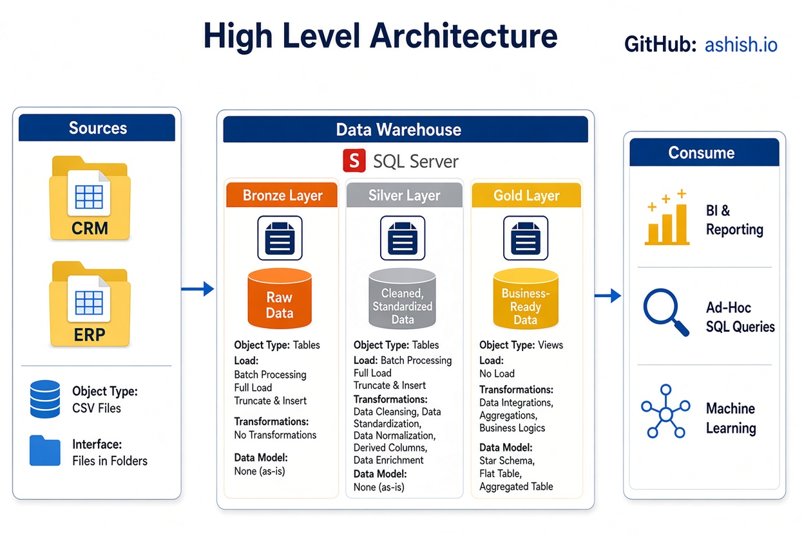

# Data Warehouse and Analytics Project

Welcome to the **Data Warehouse and Analytics Project** repository! 🚀

This project demonstrates a comprehensive, end-to-end data warehousing, from raw data ingestion to business-ready insights. It is designed as a portfolio project that highlights industry best practices in data engineering, data modeling, and analytics.

---

## 🏗️ Data Architecture

The data architecture for this project follows the **Medallion Architecture**, structured into **Bronze**, **Silver**, and **Gold** layers:

1. **Bronze Layer** — Stores raw data exactly as received from source systems. Data is ingested from CSV files into a SQL Server database with no transformations applied.
2. **Silver Layer** — Applies data cleansing, standardization, and normalization to prepare the data for analysis.
3. **Gold Layer** — Houses business-ready data modeled into a star schema, optimized for reporting and analytics.

---

## 📖 Project Overview

This project covers:

1. **Data Architecture** — Designing a modern data warehouse using the Medallion Architecture (Bronze, Silver, Gold layers).
2. **ETL Pipelines** — Extracting, transforming, and loading data from source systems into the warehouse.
3. **Data Modeling** — Developing fact and dimension tables optimized for analytical queries.

🎯 This repository serves as a practical resource for demonstrating skills in:

- SQL Development
- Data Architecture
- Data Engineering
- ETL Pipeline Development
- Data Modeling

---

## 🚀 Project Requirements

### Building the Data Warehouse (Data Engineering)

#### Objective
Develop a modern data warehouse using SQL Server to consolidate sales data, enabling analytical reporting and informed decision-making.

#### Specifications
- **Data Sources**: Import data from two source systems (ERP and CRM) provided as CSV files.
- **Data Quality**: Cleanse and resolve data quality issues prior to analysis.
- **Integration**: Combine both sources into a single, user-friendly data model designed for analytical queries.
- **Scope**: Focus on the latest dataset only; historization of data is not required.
- **Documentation**: Provide clear documentation of the data model to support both business stakeholders and analytics teams.

---

## 🛡️ License

This project is licensed under the [MIT License](LICENSE). You are free to use, modify, and share this project with proper attribution.

---
